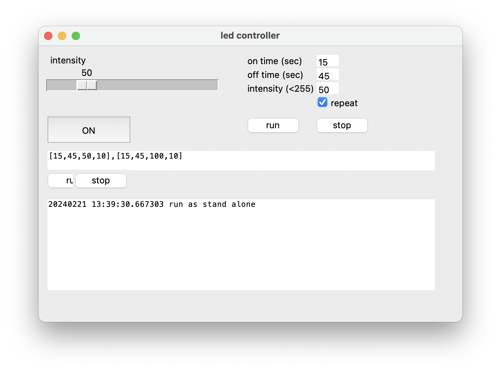

# CCS LED controller

## Overview
This program turn on/off LED light connected to CCS's controller https://www.ccs-inc.co.jp/products/model/3308.

You can program duration of on/off time and intensity and iteration number.

## Requirement
- LED controller; PD3-3024-3-PI, (CCS Inc.)
- Blue ring led; LDR2-90BL2, (CCS Inc.)
- windows laptop connected to the controller by ethernet.

## Installation
### setup the computer 
The PC laptop sould not connected to the network and set the IP address of the PC and CCS controller as manufabture's instruction.

In short; 

PC IP; 192.168.0.16
subnet musk; 255.255.255.0

CCS controller IP; 192.168.000.2

### compile
If you need binary form, you may use `cx_freeze` to compile this script.

## Usage
### intensity
You can change intensity of light by slider. The value of top of slider is applid only when you click the large ON button under the slider.

### program
You can program the light intensity, on/off durion and iteration number. To do so, input the program into the textbox locates middle part of GUI as following format.

[[on time duration (sec), off time duration (sec), intensity, repeat times],[]]

eg. `[[15,45,50,5],[15,45,100,5],[15,45,150,5]]`

This program will turn on the light with an intensity of 50 for 15 sec and then turn ir off. Turn back on after 45 sec and repeated 5 times and so on.

To start the program, click `run` button.

You will see the log in the botom larg log space.

### debugging
You can run this program without actual device. Under such situation, it will run as standalone mode. You can modifiy the GUI components and see if the light stimulation program evoked as expected.

<!-- 
## Note
## Features 
## Author -->

## Reference
Kawano, Taizo et al. “ER proteostasis regulators cell-non-autonomously control sleep.” Cell reports vol. 42,3 (2023): 112267. doi: 10.1016/j.celrep.2023.112267

## Licence
MPL-2.0
